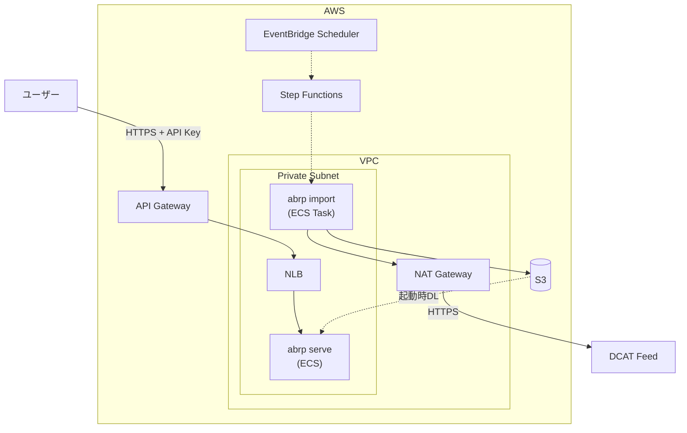
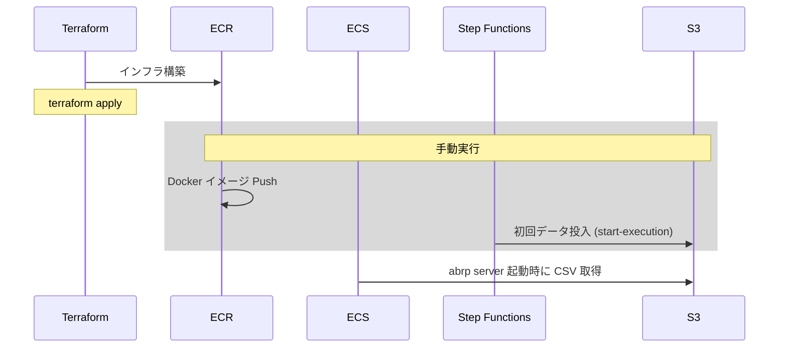

# AWS デプロイガイド

abrp を AWS 環境で運用するための構成と手順である。

## アーキテクチャ



## Terraform 構成

```
terraform/
├── bootstrap/        # tfstate backend (S3 + DynamoDB)
├── modules/
│   ├── network/      # VPC, Subnet, NAT, VPC Endpoint (S3/ECR), Security Groups
│   ├── storage/      # S3 (CSV cache), ECR
│   ├── ecs/          # ECS Cluster, Task Definition (serve/import), Service, NLB
│   ├── api_gateway/  # API Gateway REST API, VPC Link, API Key
│   └── workflow/     # Step Functions, EventBridge Scheduler (日次更新自動化)
└── main.tf           # 環境定義
```

## デプロイ手順

### 前提条件

- Terraform >= 1.0
- AWS CLI 設定済み
- 適切な IAM 権限
- Docker buildx
- git
- jq

以降のコマンドは以下を前提とする:

```bash
export AWS_REGION=ap-northeast-1
```

### CloudWatch Logs role 未設定のアカウントのみ

```bash
aws apigateway get-account --query cloudwatchRoleArn --output text
```

出力が `None` なら、API Gateway が CloudWatch Logs にログを出力するために以下を実行（アカウント全体で1度だけ）。

```bash
# Trust policy
cat > /tmp/apigw-trust.json <<'EOF'
{"Version":"2012-10-17","Statement":[{"Effect":"Allow","Principal":{"Service":"apigateway.amazonaws.com"},"Action":"sts:AssumeRole"}]}
EOF

# Create role + attach policy
ROLE_ARN=$(aws iam create-role \
  --role-name apigw-cloudwatch \
  --assume-role-policy-document file:///tmp/apigw-trust.json \
  --query 'Role.Arn' --output text)

aws iam attach-role-policy \
  --role-name apigw-cloudwatch \
  --policy-arn arn:aws:iam::aws:policy/service-role/AmazonAPIGatewayPushToCloudWatchLogs

# Register to API Gateway account setting
aws apigateway update-account \
  --patch-operations op=replace,path=/cloudwatchRoleArn,value=$ROLE_ARN
```

### Bootstrap（初回のみ）

S3 バケット `abrp-tfstate-${ACCOUNT_ID}` と DynamoDB `abrp-terraform-lock` を作成し、bootstrap 自身の state も同じバケットに同居させる (chicken-and-egg を `terraform init -migrate-state` で解消する標準パターン)。

```bash
cd docs/aws/terraform/bootstrap

# 1. backend resources を作成 (まだ S3 backend が存在しないため backend 抜きで init)
terraform init -backend=false
terraform apply

# 2. backend resources ができたので、bootstrap 自身の state も S3 へ migrate
terraform init -migrate-state \
  -backend-config="bucket=abrp-tfstate-$(aws sts get-caller-identity --query Account --output text)" \
  -backend-config="dynamodb_table=abrp-terraform-lock" \
  -backend-config="region=ap-northeast-1"
# プロンプトに "yes" を入力 → local の terraform.tfstate が S3 にコピーされる

# 3. ローカルの state を削除 (以後は S3 backend から参照)
rm -f terraform.tfstate terraform.tfstate.backup
```

別のマシンで作業する場合、bootstrap をやり直す必要はない。以下の init で state を再取得できる:

```bash
cd docs/aws/terraform/bootstrap
terraform init \
  -backend-config="bucket=abrp-tfstate-$(aws sts get-caller-identity --query Account --output text)" \
  -backend-config="dynamodb_table=abrp-terraform-lock" \
  -backend-config="region=ap-northeast-1"
```

### 環境構築

```bash
cd docs/aws/terraform
terraform init \
  -backend-config="bucket=abrp-tfstate-$(aws sts get-caller-identity --query Account --output text)" \
  -backend-config="dynamodb_table=abrp-terraform-lock" \
  -backend-config="region=ap-northeast-1"
terraform apply
```

VPC Link の構築に時間がかかるため、apply 全体で15分程度を要する。

## 初回構築

### データフロー



### 環境変数の設定

以降のステップで使う値を Terraform output からまとめて export する（`docs/aws/terraform` ディレクトリで実行）。

```bash
export ECR_URL=$(terraform output -raw ecr_repository_url)
export ECS_CLUSTER=$(terraform output -raw ecs_cluster_name)
export SFN_ARN=$(terraform output -raw state_machine_arn)
export API_ENDPOINT=$(terraform output -raw api_endpoint)
export API_KEY=$(terraform output -raw api_key_value)
export CACHE_BUCKET=$(terraform output -raw cache_bucket_name)
```

### Docker イメージのビルド・プッシュ

```bash
# プロジェクトルートで実行
cd /path/to/abr-postcode

aws ecr get-login-password | \
  docker login --username AWS --password-stdin $(echo $ECR_URL | cut -d'/' -f1)

docker buildx build --platform linux/arm64 \
  --build-arg COMMIT=$(git rev-parse --short HEAD) \
  -t $ECR_URL:latest --push .
```

### 初回データ投入

ECS サーバーは起動時に S3 から CSV を読み込む。初回は S3 が空なので、Step Functions を手動実行して CSV を投入する。`terraform apply` 直後の serve タスクは CSV が揃うまでリトライするため、Step Functions が成功すれば次のリトライで自動的に healthy になる。

```bash
# Step Functions を起動して DCAT → CSV変換 → S3 アップロード（完了まで数分）
aws stepfunctions start-execution --state-machine-arn $SFN_ARN

# healthy になるまで待つ
aws ecs wait services-stable --cluster $ECS_CLUSTER --services abrp-service
```

> serve タスクが CSV 投入後も healthy にならない場合は、`aws ecs update-service --cluster $ECS_CLUSTER --service abrp-service --force-new-deployment` で再起動する。

### 動作確認

```bash
curl -s "${API_ENDPOINT}post_code/1500001" -H "X-API-Key: ${API_KEY}" | jq '.[0]'
```

## 運用

### API アクセス

```bash
# ヘルスチェック
curl -H "X-API-Key: $API_KEY" "${API_ENDPOINT}health"

# 郵便番号 → 住所
curl -H "X-API-Key: $API_KEY" "${API_ENDPOINT}post_code/1500001"

# 全国地方公共団体コード → 市区町村
curl -H "X-API-Key: $API_KEY" "${API_ENDPOINT}lg_code/131016"

# 町字コード → 住所・郵便番号
curl -H "X-API-Key: $API_KEY" "${API_ENDPOINT}machiaza/131016/0001001"
```

API 仕様は [openapi/openapi.yml](../../openapi/) を参照。

### データ更新ワークフロー

EventBridge Scheduler が毎日 02:00 JST に Step Functions を実行する。

1. **CheckChanges** — `abrp import --dry-run` を実行し、S3 から復元した `data_modified.txt` を DCAT Feed と比較
   - 終了コード 0: データは最新。**NoChanges** で終了し、再デプロイは行われない
   - 終了コード 1: 更新あり。**UpdateData** へ進む
   - それ以外: **CheckChangesFailed** として実行を失敗させ、クラッシュが更新ありと誤認されるのを防ぐ
2. **UpdateData** — `abrp import` で ABR データをダウンロード・変換し、CSV を S3 にアップロード
3. **RefreshService** — serve タスクを ForceNewDeployment でローリング再起動し、最新 CSV を配布

### 手動トリガー

```bash
aws stepfunctions start-execution --state-machine-arn $SFN_ARN
```

### ログ確認

```bash
# ECS server (リアルタイム)
aws logs tail /ecs/abrp --follow

# import タスク (Step Functions 実行時)
aws logs tail /ecs/abrp/import --follow

# Step Functions 実行ログ
aws logs tail /aws/stepfunctions/abrp-data-update --follow

# API Gateway アクセスログ
aws logs tail /aws/apigateway/abrp --follow
```

### イメージ更新

新しい Docker イメージを ECR へ push 後、ECS サービスを強制再デプロイする。

```bash
# 「Docker イメージのビルド・プッシュ」セクションの手順を実行
# ↓
# サービスを新しいイメージで再起動
aws ecs update-service --cluster $ECS_CLUSTER --service abrp-service --force-new-deployment

# 安定するまで待機
aws ecs wait services-stable --cluster $ECS_CLUSTER --services abrp-service
```

### ロールバック

S3 CSV キャッシュは versioning が有効なので、過去バージョンを復元できる。

```bash
aws s3api list-object-versions --bucket $CACHE_BUCKET --prefix city.csv
aws s3api copy-object --bucket $CACHE_BUCKET --key city.csv \
  --copy-source "${CACHE_BUCKET}/city.csv?versionId=<VERSION>"
# ECS 再起動
aws ecs update-service --cluster $ECS_CLUSTER --service abrp-service --force-new-deployment
```

### リソース削除

```bash
cd docs/aws/terraform
terraform destroy
```

## 参考

- [Dockerfile](../../Dockerfile)
- [Terraform Modules](./terraform/modules/)
- [OpenAPI 仕様](../../openapi/)
